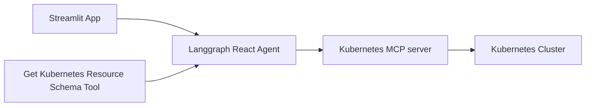
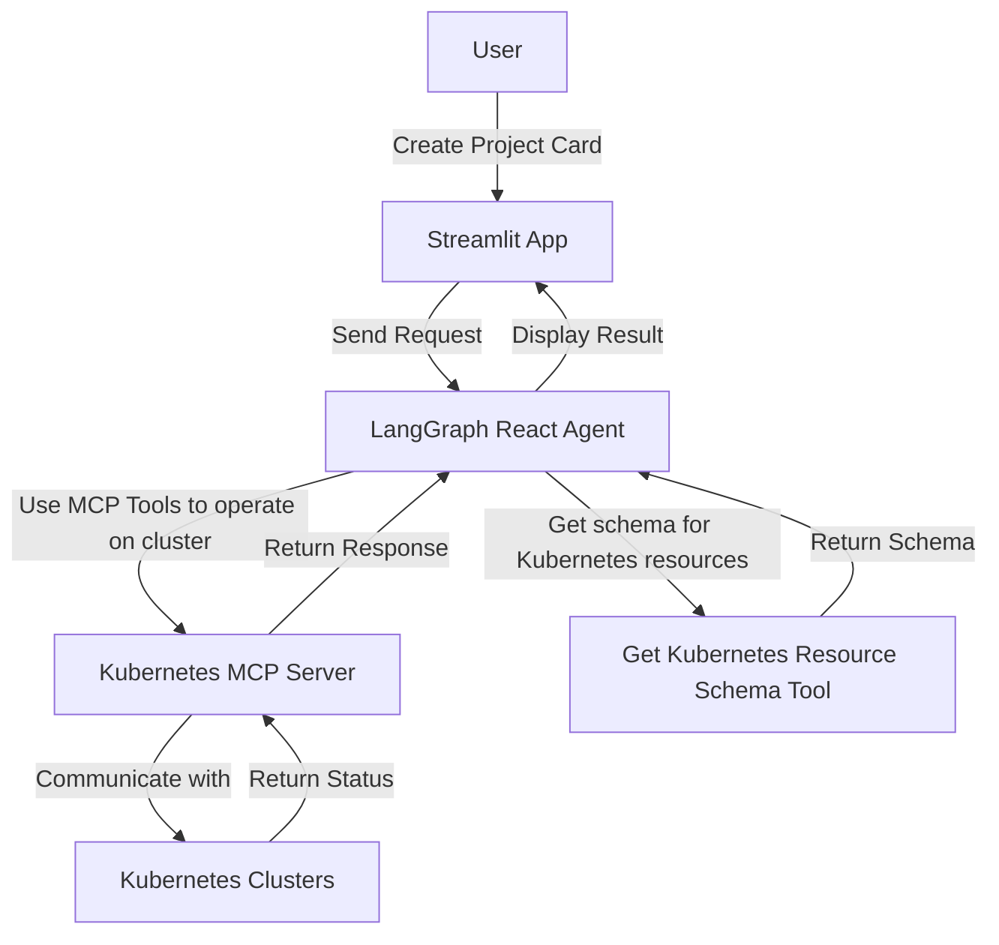

# kubernetes-genai-agent-app
This is sample app for Kubernetes GenAI Orchestrator. Users create a project card with set of instructions and it will be processed using MCP tools. It perform all Kubernetes related operations such as kubectl apply, kubectl get, kubectl delete, etc. It also can install helm charts. 

## Architecture


## Request Flow


## Setup
### Prerequisites
- Python 3.8 or higher
- Docker and docker-compose
- Kubernetes cluster (minikube, kind, or any cloud provider)
- Node and Npx. [Click Here](https://nodejs.org/en/download)

### Setup Python env
1. Create virtualenv
```bash
python -m venv .venv
```
2. Activate virtualenv
```bash
source .venv/bin/activate
```
3. Install dependencies
```bash
pip install -r requirements.txt
```

### Run app
- Start DynamoDB Docker
```bash
docker-compose up -d
```

- Initialise DB when starting the app for the first time
```bash
sh init.sh

```
- app uses below environment variables
  - `LLM_MODEL_PROVIDER`: It can be "google" or "huggingface"
    - For google, set `GOOGLE_API_KEY` environment variable with your Google API key. [Check here](https://aistudio.google.com/apikey)
    - For huggingface, Configure huggingface-cli as mentioned [here](https://huggingface.co/docs/huggingface_hub/en/guides/cli#command-line-interface-cli)

- Run app with Gemini LLM
```bash
export LLM_MODEL_PROVIDER=google
export GOOGLE_API_KEY=<your_google_api_key>
streamlit run main.py
```

- Run app with Hugging Face LLM
```bash
export LLM_MODEL_PROVIDER=huggingface
huggingface-cli login
streamlit run main.py
```